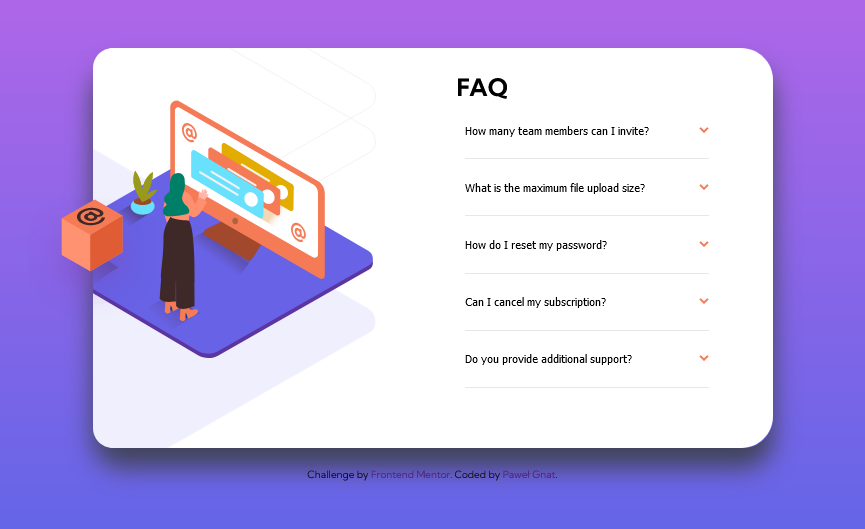

# Frontend Mentor - FAQ accordion card solution

This is a solution to the [FAQ accordion card challenge on Frontend Mentor](https://www.frontendmentor.io/challenges/faq-accordion-card-XlyjD0Oam). Frontend Mentor challenges help you improve your coding skills by building realistic projects.

## Table of contents

- [Overview](#overview)
  - [Screenshot](#screenshot)
  - [Links](#links)
- [My process](#my-process)
  - [Built with](#built-with)
  - [What I learned](#what-i-learned)
- [Author](#author)

## Overview

### Screenshot

### Links

- Live Site URL: [FAQ Accordion Card](https://pawel-gnat.github.io/Frontend-Mentor-FAQ-Accordion-Card/)

## My process

Below is my thinking process of Java Script code:

1. Created consts
2. Created an if function that add or remove active class on elements
3. Created a function that close my accordion text and rotate an arrow
4. Created a function that close my accordion while I clicked somewhere else
5. Created event on buttons using forEach
6. Created event that call "clickoutside" function out

### Built with

- Semantic HTML5 markup
- CSS custom properties
- Flexbox
- Mobile-first workflow
- JavaScript

### What I learned

I struggled to do this challenge in 15 hours. I had a really hard times with javascript, images and toggling accordeon with arrow. I learned A LOT (css selectors, ::after pseudoelement), but I still think this challenge was hard. I didn't like that bold font on button focus, so I decided to not code it.

## Author

- Frontend Mentor - [@Pawel-Gnat](https://www.frontendmentor.io/profile/Pawel-Gnat)
